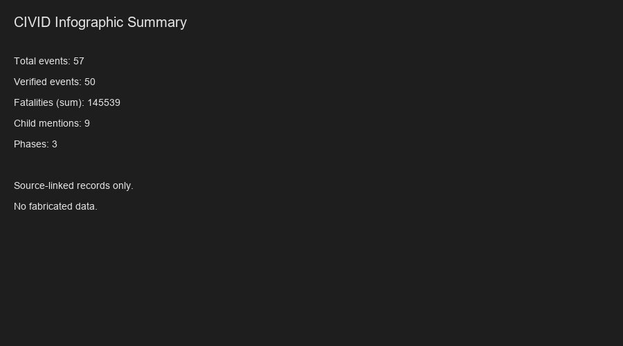
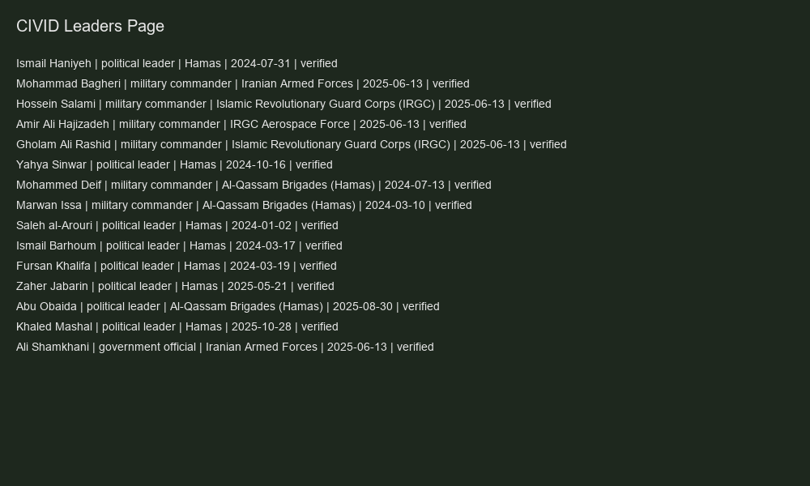
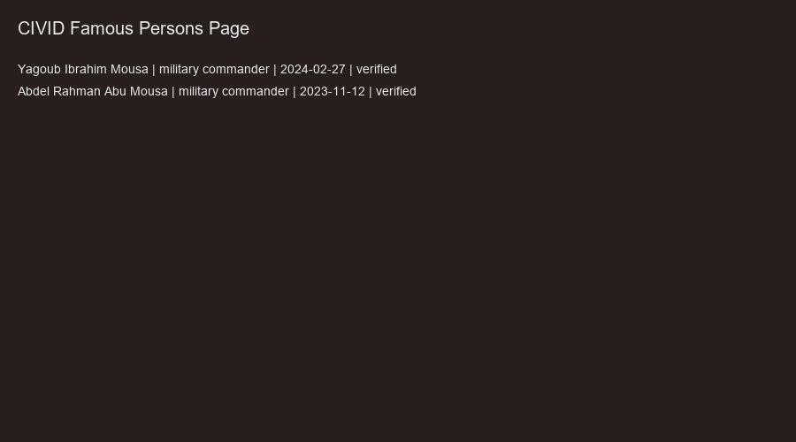
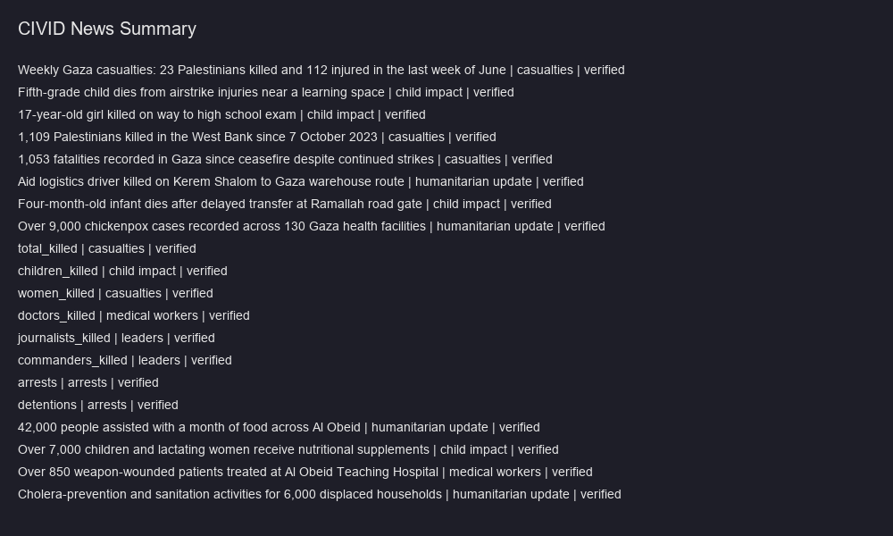

# CIVID — Civilian Impact Verified Incident Dataset

**Author / Maintainer:** Muhammad Farhan
**License:** code MIT (© Muhammad Farhan); underlying data per publisher — see `DATA_LICENSE.md`.

A clean, source-verified, multi-country conflict impact dataset built for research,
analytics, and machine learning use — with strict citation, provenance, and ethics
requirements on every record.

## Purpose

CIVID collects verifiable, citable data on civilian-impacting events in active conflict
zones — casualties, displacement, health-system disruption, infrastructure damage — from
authoritative humanitarian sources only. Every record traces back to a named source with
a URL and citation text. Nothing is invented, estimated silently, or presented as more
certain than the source allows.

## What's included

| Phase | Country | Status | Events | Leaders (verified) | Sources |
|---|---|---|---|---|---|
| 1 | Palestine / Gaza | Active | 34 verified + 8 unverified/pending review | 14 (Hamas/RSF/etc., verified) | OCHA, UNRWA, OHCHR, ACLED, HDX, MoH Gaza, Reuters, AP |
| 2 | Sudan | Expanded | 18 (verified/estimated) | 2 (RSF commanders, verified) | ICRC, ACLED, UN OCHA Sudan, WHO Sudan, Reuters |
| 3 | Iran (Iran–Israel Twelve-Day War) | Built from cited sources | 5 (aggregates + verified incidents) | 8 (7 confirmed dead 13 Jun 2025 + Khamenei death-claim) | HRANA, Iran MoH, AP, ACLED, Reuters |
| 4 | Additional countries | Scaffolding (Yemen Houthi lead held) | 0 | 1 (unverified review item) | see `docs/` phase notes |

> **Combined snapshot:** 57 events (all verified, 0 unverified production), 25 leader records, 16 person records, 2 famous-victim rows. The famous-victims section is populated via the human-reviewed pipeline in `docs/famous_victims_policy.md`. Regenerate exports with `python scripts/build_exports.py`.

> **Iranian leadership (Phase 3):** 7 senior figures confirmed killed in the 13 June 2025 Israeli strikes on Tehran (Bagheri, Salami, Hajizadeh, Rashid, Shamkhani, Abbasi, Tehranchi) per ACLED/HRANA. Ali Khamenei (Supreme Leader) is recorded as a **death claim — reported killed, unverified, needs_review=true** — held in the review queue pending a reliable cited source (not asserted as a verified casualty). Portraits are CC BY-SA 4.0 Wikimedia Commons; 14 leader photos are stored locally, 3 Iran portraits (Khamenei, Salami, Rashid) have correct URLs but no local file (network-restricted sandbox — fetch via `scripts/fetch_leader_photos.py`).

**Phase 3 update (18 July 2026):** Phase 3 (Iran–Israel Twelve-Day War, June 2025) is now
populated with **cited, verified data** — no fabrication. It includes two aggregate casualty
figures (Iran MoH: 1,060 killed / 5,800 injured; HRANA: 1,190 killed / 4,475 injured with a
civilian/military/unconfirmed breakdown), two verified incident rows (the 13 June 2025 Tehran
command-center strike; ACLED's ~360 strikes across 27 provinces), and four named, confirmed
military commanders killed (Bagheri, Salami, Hajizadeh, Rashid) recorded in `persons.csv` with
`is_famous=true`. All aggregate rows are explicitly labeled `AGGREGATE` in `notes` and marked
`confidence_level=medium` (reported-by-source, not independently re-verified). Sources: HRANA,
Iran Ministry of Health, Associated Press, ACLED.

**Phase 1 update (18 July 2026):** Added Gaza cumulative aggregates (MoH: 67,075 killed as of
3 Oct 2025; 73,231 killed as of 13 Jul 2026), OCHA ceasefire-period aggregates (618 killed /
1,663 injured by 25 Feb 2026; 31 storm-related deaths including 7 children), and verified
incident rows (PRCS paramedic killed in Mawasi; 82 killed / 162 injured reporting week). A
verified PRCS medic person row was added. All aggregates are labeled and medium-confidence.

**Note on "full per-person Gaza data":** A complete named list of every Gaza casualty cannot be
verified or ethically sourced (MoH publishes aggregates, not a verified per-person register;
major outlets report aggregates + named cases only). CIVID therefore records **cited
aggregates** plus **verified individual incidents** where sources name them — never inferred or
fabricated victim rows. This is consistent with the no-fabrication principle in
`docs/usage_disclaimer.md`.

**Phases 3 & 4 are populated only with cited, verified data.** Per the core no-fabrication
principle, **no event/victim/leader data is added until backed by an authoritative, cited source
and human-reviewed.** Phase 4 currently holds one unverified Yemen lead (LDR-024) in the review
queue; it is not asserted as fact. Nothing is invented to "fill" a phase.

**Phase 1 update (14 July 2026):** 8 verified events (EVT-028..035, from OCHA oPt SitRep
10 July 2026, UNRWA SitRep #229, and a Security Council Report/OCHA briefing) were merged
in from the `phase1_new_*.csv` drafts. Their draft `event_id`s (EVT-014..021) collided with
existing rows and were renumbered to EVT-028..035 to preserve event-ID uniqueness and the
persons→events foreign key; the renumbering is logged in each row's `notes`. The 8
`unverified` HDX-derived rows (EVT-020..027) remain flagged `low` confidence and await
manual source review before promotion.

**Data quality note:** Phase 2's second batch is concentrated in ICRC and ACLED sources
after WHO/UNHCR/OCHA direct-site fetches were blocked. This is logged as a `batch_note`
in `sources.csv` and flagged for future diversification — it is not hidden or smoothed over.

## Folder structure

```
CIVID/
├── data/
│   ├── reference/                    # Controlled vocabularies (global)
│   │   ├── roles.csv                 # Role taxonomy + hierarchy + flag mapping
│   │   ├── location_types.csv        # Canonical location types + synonyms
│   │   └── source_reliability_tiers.csv
│   ├── phase1_palestine/             # events, persons, sources, media, entities, famous_victims
│   ├── phase2_sudan/                 # events, persons, sources, media, entities, famous_victims
│   ├── phase3_iran/                  # scaffolding (headers only, no data yet)
│   ├── phase4_additional/            # scaffolding (headers only, no data yet)
│   └── staging/                      # pending_review.csv + rejected.csv (human-review queue)
├── schema/                          # JSON Schemas: events, persons, sources, media, entities, roles, famous_victims
├── docs/                            # Quality rules & policies (dedup, normalization, reliability, entity resolution, role hierarchy, ambiguity, usage, famous-victims, infographic, daily script)
├── scripts/
│   ├── validate_dataset.py          # Integrity + controlled-vocab checks (stdlib)
│   ├── renumber_records.py          # Sequential record_id/famous_id, legacy preserved (stdlib)
│   ├── build_exports.py             # Builds exports/ with derived dashboard/ML fields (stdlib)
│   └── ... (daily_update, promote, infographic, etc.)
├── exports/                         # Generated, export-ready CSV/JSON (dashboard + ML ready)
├── notebooks/                       # phase1_analysis, phase2_analysis, master_dashboard, iran_leaders_photos
├── LICENSE                          # MIT (code only)
├── DATA_LICENSE.md                  # Data terms & usage disclaimer
├── data_dictionary.md
├── CHANGELOG_renumber.md            # Record of each sequential renumbering run
└── README.md
```

### Dataset tables (per phase, linkable)

| Table | Purpose | Key |
|---|---|---|
| `events.csv` | Event-level incidents/impacts | `event_id` (unique per phase) |
| `persons.csv` | Victim/person records (only when a source supports them) | `record_id` → `event_id` |
| `sources.csv` | Source registry with reliability scores | `source_id` |
| `media.csv` | Licensed media index (no victim imagery; ethics-gated) | `media_id` |
| `entities.csv` | Organizations, conflict actors, facilities, named leaders | `entity_id` |
| `famous_victims.csv` | Special section: notable publicly-reported individuals (ethics-gated, human-reviewed, empty by design) | `famous_id` |
| `news_intelligence.csv` | News intelligence layer: citable aggregate metrics + source-linked stories | `news_id` |
| `dashboard_metadata.csv` | Key-value dashboard config (filters, enabled sections) | `meta_key` |
| `data/reference/roles.csv` | Global role taxonomy + hierarchy | `role_id` |

Row primary keys (`record_id`/`famous_id`) are renumbered to a gap-free `1..N` sequence per
table via `scripts/renumber_records.py`; the original id is preserved in `legacy_record_id`,
and `event_id` stays stable as the cross-table link.

## Quality tooling

```bash
python scripts/validate_dataset.py             # integrity, FK, controlled-vocab, dupes -> exit 0 if clean
python scripts/renumber_records.py             # sequential record_id/famous_id (legacy preserved) + change log
python scripts/build_exports.py                # regenerate exports/ (combined CSV/JSON + derived fields)
python scripts/generate_news_intelligence.py  # build the news_intelligence table from verified aggregates
python scripts/generate_html_dashboard.py      # write output/ multi-page dashboard
python scripts/dashboard_server.py             # serve dashboard at http://localhost:8080/
python scripts/open_dashboard.py               # start server and open browser automatically
python scripts/run_pipeline.py                 # full pipeline: validate -> renumber -> news -> export -> dashboard -> infographic -> phase check
python scripts/infographic.py                  # regenerate output/images/*.png placeholders (requires matplotlib for real charts)
python scripts/daily_update.py                 # pull new report leads into the staging review queue (unverified)
python scripts/promote_entry.py                # promote a reviewed staging row to verified events.csv
python scripts/bulk_promote.py                 # bulk-promote all staging rows as unverified
python scripts/verify_deaths.py                # apply funeral/burial death-verification rule to a leader
python scripts/fetch_leader_photos.py          # download verified leader portraits locally
python scripts/verify_leader_images.py         # check local/remote image integrity
python scripts/github_autopush.py              # guarded auto-push (dry-run by default; --push after approval)
python scripts/setup_daily_schedule.py         # print Windows Task Scheduler / cron command for daily runs
python scripts/cleanup_logs.py                 # trim old run_log.json entries
```

Full pipeline (validate → renumber → export → news → dashboard → infographic → phase check):

```bash
python scripts/run_pipeline.py
```

With infographics (requires matplotlib in the active environment):

```bash
python scripts/run_pipeline.py
```

Dry-run push (no commit):

```bash
python scripts/github_autopush.py
```

Commit and push after approval:

```bash
python scripts/github_autopush.py --push
```

Approval workflow: `daily_update.py` → review in `data/staging/pending_review.csv` →
`promote_entry.py` → validate → `github_autopush.py --push`. See
`docs/approval_autopush_workflow.md`, `docs/news_intelligence.md`, `docs/html_dashboard.md`.

### Quality policies (`docs/`)

- `deduplication_rules.md` — dedup keys and merge/keep rules
- `normalization_rules.md` — field normalization (what to fix, what never to touch)
- `source_reliability_scoring.md` — reliability tiers A–E
- `entity_resolution.md` — resolving repeated names to canonical entities
- `role_hierarchy.md` — role vocabulary → flags → categories
- `ambiguity_and_missing_data.md` — missing/ambiguity flags + human-review queue
- `usage_disclaimer.md` — safety, privacy, neutrality, and usage terms
- `famous_victims_policy.md` — ethics rules + human-gated scraper pipeline for the famous-victims table
- `infographic_generator.md` — design of the aggregate, non-graphic chart generator
- `daily_extraction_script.md` — design of the source-safe daily lead-discovery pipeline

## How to run

```bash
conda activate civid
jupyter notebook notebooks/master_dashboard.ipynb
```
Then **Run All** to regenerate every chart and summary table from the current CSVs.

If the `civid` kernel isn't listed in Jupyter:
```bash
pip install ipykernel
python -m ipykernel install --user --name=civid --display-name "Python (civid)"
```

## Methodology & ethics summary

Every record requires at least one source citation (`source_url` + `citation_text`).
Facts not directly supported by a source are marked `unverified` rather than assumed.
Age, gender, and role fields are never inferred — only recorded when a source states them
explicitly, and roles use a fixed controlled vocabulary. No victim or casualty imagery is
collected or displayed; only source-provided, licensed images of infrastructure or aid
response are eligible for inclusion, and only when the source's own license permits reuse.
Full rules are defined in `docs/` and `schema/*.json`.

## Licensing

- **Code and repo structure** (scripts, notebooks, schema): MIT License.
- **Underlying data**: sourced from public humanitarian reporting (OCHA, UNRWA, ICRC, ACLED,
  and others as cited per-row in `sources.csv`). This dataset does not claim ownership of
  that data — it re-organizes and cites it. Redistribution of the underlying facts should
  respect the terms of each original publishing organization.
- This dataset makes no claims beyond what its cited sources state. Verification status
  and confidence level are recorded per-row precisely so downstream users can filter by
  certainty rather than treat all rows as equally authoritative.

## Dashboard

A multi-page HTML dashboard is generated into `output/`:

- **Home** — summary cards, charts (timeline, verification, phase, roles), pipeline status, and a big **Run Now / Refresh Dataset** button.
- **Review Queue** — all unverified / disputed events and persons with search and phase filter.
- **Leaders** — verified leader deaths with images, bios, and source links.
- **Famous Persons** — notable individuals with images and bios (ethics-gated).
- **News Intelligence** — curated source-linked stories and aggregate metrics.
- **Logs** — pipeline run history with timestamps, durations, and errors.
- **Data Explorer** — full event table with CSV/JSON downloads.

Start the dashboard server:
```bash
python scripts/dashboard_server.py
# open http://localhost:8080/
```

Trigger a manual pipeline run from the dashboard with the **Run Now** button, or from the command line:
```bash
python scripts/run_pipeline.py
```

Auto-update workflow (daily):
```
source discovery -> extract -> verify -> deduplicate -> confidence scores -> exports -> infographic -> dashboard -> README update -> push (approval-gated)
```

## Workflow diagram

```
[Daily Schedule / Run Now Button]
        |
        v
[validate_dataset.py] --> abort on errors
        |
        v
[renumber_records.py]  --> gap-free IDs, legacy preserved
        |
        v
[generate_news_intelligence.py] --> aggregates + curated stories
        |
        v
[build_exports.py]     --> CSV/JSON exports + summary
        |
        v
[generate_html_dashboard.py] --> multi-page dashboard
        |
        v
[infographic.py]       --> PNG summary images
        |
        v
[phase_orchestrator.py] --> advance phase if complete
        |
        v
[github_autopush.py --push] --> commit + push (approval required)
```

## Update frequency

- **Daily auto-update:** schedule `python scripts/run_pipeline.py` via Windows Task Scheduler or cron.
- **Manual update:** click **Run Now** in the dashboard or run `python scripts/run_pipeline.py` directly.
- **Approval gate:** GitHub push requires `--push` flag; unverified rows are never auto-pushed.

## Leader image verification

For every leader or famous person:
- If a public-safe image exists, `image_url`, `image_source`, `image_license`, and `image_caption` are stored.
- If rights are unclear or no image exists, image fields are left blank.
- If sources disagree on identity, `verification_status = "needs_review"`.
- Run `python scripts/fetch_leader_photos.py` to download verified portraits locally.
- Run `python scripts/verify_leader_images.py` to check local integrity and remote Commons provenance.

## Source policy

- Prefer official and primary sources (OCHA, UNRWA, OHCHR, ICRC, ACLED, MoH, WHO, UNHCR).
- Use Guardian, Reuters, AP, BBC, Al Jazeera, and Wikipedia only where appropriate and permitted.
- Every record stores `source_name`, `source_url`, `source_date`, `source_type`, and `citation_text`.
- Aggregate figures are explicitly labeled and marked `confidence_level=medium`.
- No data is fabricated; missing evidence is marked `unverified` or `needs_review`.

## Dashboard

A professional multi-page HTML dashboard is generated into `output/`:

### Screenshots

#### Home Overview


#### Infographic Summary


#### Leaders Page


#### Famous Persons


#### News Summary


### How to run

**Option 1 — One-click launcher (recommended):**
```bash
python scripts/open_dashboard.py
# Browser opens automatically at http://localhost:8000/civid_dashboard.html
```

**Option 2 — Manual:**
```bash
# Terminal 1: start server
python scripts/dashboard_server.py 8000

# Terminal 2: open browser
# Navigate to http://localhost:8000/civid_dashboard.html
```

**Option 3 — Jupyter Notebook:**
```bash
jupyter notebook notebooks/master_dashboard.ipynb
```

### Dashboard pages

| Page | URL | Description |
|---|---|---|
| Home | `/` or `/civid_dashboard.html` | Summary cards, charts, pipeline status, Run Now button |
| Gaza | `/pages/gaza.html` | Gaza / Palestine specific data |
| Sudan | `/pages/sudan.html` | Sudan specific data |
| Iran | `/pages/iran.html` | Iran specific data |
| Leaders | `/pages/leaders.html` | Leaders with images, bios, source links |
| Famous Persons | `/pages/famous_persons.html` | Notable individuals gallery |
| Children | `/pages/children.html` | Child records (privacy-safe) |
| Medical Workers | `/pages/medical_workers.html` | Doctors, nurses, medics, aid workers |
| Journalists | `/pages/journalists.html` | Journalists and media workers |
| News Intelligence | `/pages/news_intelligence.html` | Curated source-linked stories |
| Review Queue | `/pages/review_queue.html` | Unverified / disputed items |
| Data Dictionary | `/pages/data_dictionary.html` | Schema help, field definitions, source policy |

## Disclaimer

This is a research and educational dataset. It is not a legal record, an official casualty count, or a substitute for the primary humanitarian reports it cites. Always consult the original source (linked per row) before using any figure in publication or policy work.
